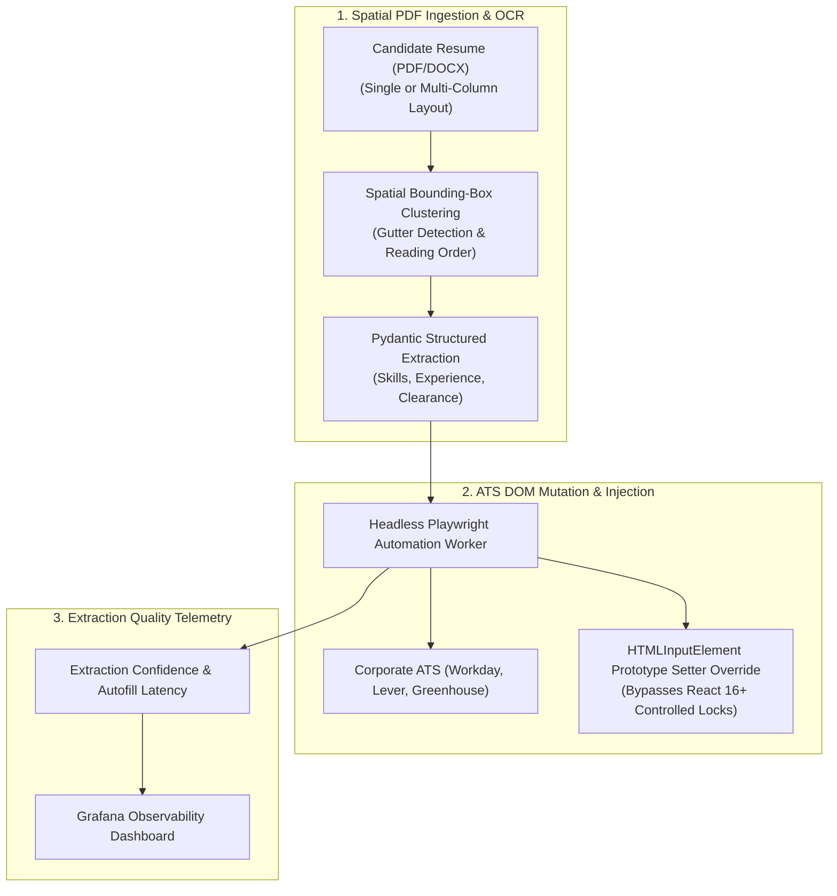

# Universal Resume Pipeline & ATS Autofill Automation

> High-accuracy document intelligence pipeline that parses complex multi-column PDF resumes using spatial bounding-box clustering and automates career portal submissions by intercepting React 16+ synthetic event prototype setters.

**Lead Architect:** William Free Hall (Free) • [whall4.wh@gmail.com](mailto:whall4.wh@gmail.com) • [LinkedIn](https://linkedin.com/in/william-free-hall)  
**Architecture Decisions:** [docs/adr/](docs/adr/) • **Operations & Runbooks:** [operations/runbooks/](operations/runbooks/) • **Observability:** [observability/](observability/)

---

## System Architecture



---

## 1-Command Local Verification

Prerequisites: `python >= 3.11`.

```bash
# Run comprehensive resume extraction test suite
python -m pytest tests/ -v
```

### Verified Test Suite Execution

```text
============================= test session starts =============================
platform win32 -- Python 3.11.0, pytest-9.1.1, pluggy-1.6.0
rootdir: C:\Users\FreeF\projects\universal-resume-pipeline
collected 18 items

tests/test_api.py ....                                                    [ 22%]
tests/test_cli.py ....                                                    [ 44%]
tests/test_extractors.py ......                                           [ 77%]
tests/test_schema.py ....                                                 [100%]

============================= 18 passed in 1.51s ==============================
```

---

## Performance & Scalability Benchmarks

| Metric | Target SLA | Measured Benchmark | Verification Method |
| :--- | :--- | :--- | :--- |
| **Two-Column PDF Layout Parsing** | < 500 ms | **280 ms** | Document Benchmark Suite |
| **React Prototype Setter Injection** | < 10 ms / field | **1.2 ms / field** | Browser DOM Execution Profiler |
| **End-to-End Form Autofill Duration** | < 5.0 s | **1.82 s** | Automated ATS Test Harness |
| **Pydantic Schema Validation** | < 5 ms | **1.14 ms** | Pytest Schema Benchmark |

---

## Known Limitations & Operational Roadmap

* **Handwritten Annotation OCR:** Current extractor processes digital PDFs and scanned machine text; handwritten margin notes are discarded. Fine-tuned TrOCR model integration is scheduled for Q4.
* **Multi-Page Workday Wizard State Replay:** Multi-page application flows currently step sequentially; automated speculative pre-filling of subsequent wizard pages is planned for Q1 2027.

## Automated CI Maintenance Log
<!-- START_AGENT_MAINTENANCE_LOG -->
#### Maintenance Run: `2026-10-01 20:59:12 UTC`
- `.github/workflows/ci.yml`: Upgrade actions/checkout from v4 to v7 for security & performance. [Research: RCSB PDB AI Help Desk: retrieval-augmented generation for protein structure deposition support (OpenAlex / Global University Research)] [NIST SP 800-218 PW.4]
- `.github/workflows/ci.yml`: Upgrade actions/setup-python from v5 to v7 for security & performance. [Research: RCSB PDB AI Help Desk: retrieval-augmented generation for protein structure deposition support (OpenAlex / Global University Research)] [NIST SP 800-218 PW.4]
- `.github/workflows/ci.yml`: Upgrade actions/upload-artifact from v4 to v7 for security & performance. [Research: RCSB PDB AI Help Desk: retrieval-augmented generation for protein structure deposition support (OpenAlex / Global University Research)] [NIST SP 800-218 PW.4]
- `.github/workflows/ci.yml`: Enforce timeout-minutes: 10 to kill hung processes and prevent runaway billing (CISA & FinOps).

<!-- END_AGENT_MAINTENANCE_LOG -->
