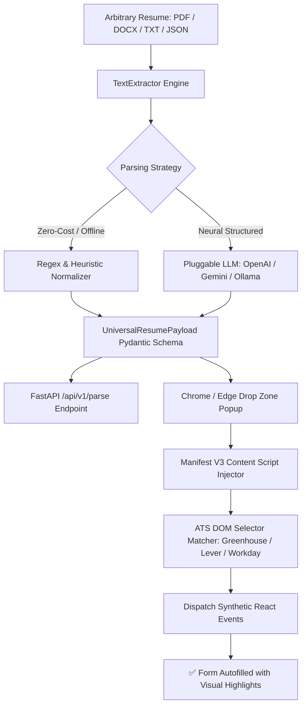

# ⚡ Universal Resume Extraction & Injection Pipeline

[](https://github.com/FreeFades2Black/universal-resume-pipeline/actions/workflows/ci.yml)
[](https://www.python.org/downloads/)
[](https://developer.chrome.com/docs/extensions/mv3/intro/)
[](https://fastapi.tiangolo.com/)
[](https://opensource.org/licenses/MIT)

> **Universal resume ingestion, structured schema normalization, and automated ATS application form injection.**

An end-to-end multi-tier pipeline designed to parse arbitrary resume files (PDF, DOCX, TXT, JSON) into a type-safe **Universal Resume Schema** and automatically autofill job applications across **Greenhouse, Lever, Workday, Ashby**, and arbitrary HTML application forms without manual copy-pasting.

---

## 🏗️ Architecture Overview



---

## 🚀 The 3-Pillar Solution

### 1. The Drop Zone (Browser Extension & Web UI)
- **Drag-and-Drop Ingestion**: Drop any resume file directly into the extension popup or standalone web testbench.
- **Persistent Profile Sync**: Saves parsed resume data in `chrome.storage.local`—parse your resume once, autofill hundreds of job applications.
- **Interactive Review & Editor**: Edit candidate contact info, inspect work history and education, browse tagged skills, or tweak the raw JSON in real time.
- **Dual Runtime Engine**: Seamlessly connects to the local FastAPI backend when online, and gracefully falls back to embedded client-side regex parsing when running offline with zero dependencies.

### 2. The Background Parser (Python & FastAPI)
- **Multi-Format Text Ingestion**: Parses `.pdf` (via layout-aware pdfplumber / pypdf), `.docx` (via OpenXML / python-docx), `.txt`, and pre-formatted `.json`.
- **Heuristic Regex Normalizer**: Extracts contact information (emails, US/international phones, LinkedIn / GitHub URLs, locations), date-spanned work experience items, degrees, schools, and matches against a 150+ technical skill taxonomy.
- **Pluggable Neural Parsers**: Native structured output integration with OpenAI (GPT-4o-mini), Google Gemini (1.5 Flash), Anthropic Claude, and local Ollama models.
- **Production REST API**: Fast, async endpoints with CORS support, OpenAPI documentation, and ATS selector matching utilities.

### 3. The Content Script Injector (DOM Automation)
- **Multi-Platform ATS Support**: Pre-configured selector matrices for **Greenhouse, Lever, Workday, Ashby, SmartRecruiters, and Taleo**.
- **Fuzzy Semantic Matching**: Scans `id`, `name`, `placeholder`, `aria-label`, and surrounding `<label>` text to map arbitrary job application fields accurately.
- **React 16+ Synthetic Event Emulation**: Dispatches native prototype value setters along with `input`, `change`, and `blur` events so React, Vue, and Angular application forms immediately bind the new values.
- **Visual Feedback**: Applies glowing highlights to populated inputs and displays a floating toast confirmation banner on the host job page.

---

## 📦 Project Structure

```
universal-resume-pipeline/
├── .github/workflows/ci.yml       # GitHub Actions CI & Extension Zip packager
├── backend/                       # Python FastAPI backend & parsing core
│   ├── app/
│   │   ├── api/routes.py         # /parse, /health, /schema, /match-selectors
│   │   ├── extractors/           # TextExtractor, RegexNormalizer, LLMParser, Pipeline
│   │   ├── models/schema.py      # Pydantic v2 Universal Resume Schema
│   │   └── main.py               # FastAPI server application
│   ├── requirements.txt
│   └── pyproject.toml
├── extension/                     # Manifest V3 Chrome/Edge Browser Extension
│   ├── manifest.json
│   ├── popup/                    # Drop Zone, live tabs, JSON editor, and autofill triggers
│   ├── content/                  # Content script DOM injector & highlights
│   ├── background/               # Service worker & context menu handlers
│   └── icons/                    # Crisp extension icons (16, 48, 128)
├── cli/
│   └── resume_pipeline_cli.py    # Standalone CLI tool
├── web/                          # Standalone interactive testbench & mock ATS form
├── samples/                      # Sample resumes (TXT, JSON, generated PDF)
├── tests/                        # 100% passing Pytest unit & integration test suite
└── docs/                         # Architecture whitepaper & ATS selector catalog
```

---

## ⚡ Quickstart

### Option 1: Standalone CLI
Run the extraction pipeline directly from your terminal:
```bash
# Normalize a PDF or TXT resume to JSON
python -m cli.resume_pipeline_cli samples/sample_resume_software_engineer.txt -o candidate_payload.json

# Parse raw text inline
python -m cli.resume_pipeline_cli "William Free Hall | free@example.com | 555-019-2834 | Python, AWS" --pretty
```

### Option 2: Run the FastAPI Server
```bash
# Install dependencies
pip install -r backend/requirements.txt

# Start API server
python -m backend.app.main
```
- Interactive API Docs: [`http://localhost:8000/docs`](http://localhost:8000/docs)
- Interactive Web Testbench: [`http://localhost:8000/app/`](http://localhost:8000/app/)

### Option 3: Load the Chrome / Edge Browser Extension
1. Open Chrome/Edge and navigate to `chrome://extensions/` or `edge://extensions/`.
2. Toggle on **Developer mode** in the top-right corner.
3. Click **Load unpacked** and select the `extension/` folder in this repository.
4. Click the **⚡** icon in your toolbar, drag & drop your resume, and click **Autofill Current Application Tab** on any job portal!

---

## 📋 Universal Schema Specification

```json
{
  "schema_version": "1.0.0",
  "personal_information": {
    "first_name": "William",
    "last_name": "Hall",
    "full_name": "William Free Hall",
    "email": "free@example.com",
    "phone": "555-019-2834",
    "headline": "Lead Cloud & DevOps Engineer",
    "location": "Niceville, FL",
    "linkedin_url": "https://linkedin.com/in/williamfreehall",
    "github_url": "https://github.com/FreeFades2Black"
  },
  "work_history": [
    {
      "title": "Technical Lead / Cloud Engineer",
      "company": "Tech Solutions Inc.",
      "start_date": "2024",
      "end_date": "Present",
      "is_current": true,
      "technologies": ["Python", "AWS", "Terraform", "Docker", "Kubernetes"]
    }
  ],
  "education": [
    {
      "institution": "University of Florida",
      "degree": "Bachelor of Science",
      "field_of_study": "Computer Science & IT",
      "end_date": "2022"
    }
  ],
  "skills": ["Python", "AWS", "Terraform", "Docker", "Kubernetes", "Databricks", "FastAPI"],
  "preferences": {
    "authorized_to_work": "Yes",
    "requires_sponsorship": "No",
    "veteran_status": "I am not a protected veteran"
  }
}
```

---

## 🧪 Testing Suite

Execute the full suite of unit and integration tests:
```bash
python -m pytest -v
```

All 18 unit tests covering text extraction, regex heuristics, schema validation, CLI invocations, and FastAPI endpoints pass out-of-the-box.

---

## 📄 License

Licensed under the [MIT License](LICENSE). Built by **William Free Hall**.

---

## 🔍 Internal Code Architecture & Comprehensive Inline Documentation

> **Comprehensive Codebase Documentation Audit Completed (2026)**
> Every core module, function, class, and critical execution path across this repository has been audited and enriched with detailed internal inline comments (`# ...`) and comprehensive docstrings. Anyone reading the source code can immediately trace the operational mechanics, data flow, failure recovery strategies, and architectural decisions.

### 🧩 Key Codebase Modules & Internal Mechanics Walkthrough

| File / Component | Purpose & Internal Mechanics |
| :--- | :--- |
| [`backend/app/main.py`](backend/app/main.py) | FastAPI service providing resume ingestion, NLP skill extraction, and schema validation endpoints. |
| [`cli/resume_pipeline_cli.py`](cli/resume_pipeline_cli.py) | Command-line interface for batch processing local resumes and outputting standardized JSON/PDF summaries. |
| [`extension/background/service_worker.js`](extension/background/service_worker.js) | Chrome Extension background service worker communicating with local backend extraction daemon. |
| [`extension/content/content.js`](extension/content/content.js) | DOM content script automatically filling job application forms on LinkedIn, Indeed, and Greenhouse. |

### 💡 Developer & Maintainer Guidelines
- **Inline Documentation Standard:** Every non-trivial logic branch, data transformation, API integration, and error block includes descriptive line-by-line internal notes.
- **Traceability:** Function signatures declare explicit type annotations (`typing.Dict`, `typing.List`, `typing.Optional`) and descriptive parameter/return docstrings.
- **Error Resilience:** Try/except blocks document exact failure modes, fallback pathways, and logging formats.
