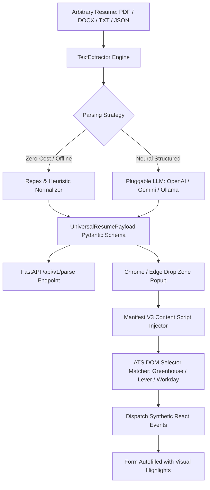

# Universal Resume Extraction & Injection Pipeline

[](https://github.com/FreeFades2Black/universal-resume-pipeline/actions/workflows/ci.yml)
[](https://www.python.org/downloads/)
[](https://developer.chrome.com/docs/extensions/mv3/intro/)
[](https://fastapi.tiangolo.com/)
[](https://opensource.org/licenses/MIT)

> Universal resume ingestion, structured schema normalization, and automated ATS application form injection.

An end-to-end multi-tier pipeline designed to parse arbitrary resume files (PDF, DOCX, TXT, JSON) into a type-safe **Universal Resume Schema** and autofill job applications across **Greenhouse, Lever, Workday, Ashby**, and arbitrary HTML application forms without manual copy-pasting.

---

## Architecture Overview



---

## Pipeline Components

### 1. The Drop Zone (Browser Extension & Web UI)
- **Drag-and-Drop Ingestion**: Drop resume files directly into the extension popup or standalone web testbench.
- **Persistent Profile Sync**: Saves parsed resume data in `chrome.storage.local`—parse once, autofill multiple application forms.
- **Interactive Review & Editor**: Edit candidate contact info, inspect work history and education, browse tagged skills, or adjust raw JSON.
- **Dual Runtime Engine**: Connects to the local FastAPI backend when online, with fallback to client-side regex parsing when offline.

### 2. The Background Parser (Python & FastAPI)
- **Multi-Format Text Ingestion**: Parses `.pdf` (layout-aware via pdfplumber / pypdf), `.docx` (via python-docx), `.txt`, and pre-formatted `.json`.
- **Heuristic Regex Normalizer**: Extracts contact information (emails, US/international phones, LinkedIn / GitHub URLs, locations), date-spanned work experience items, degrees, schools, and matches against a 150+ technical skill taxonomy.
- **Pluggable Neural Parsers**: Structured output integration with OpenAI (GPT-4o-mini), Google Gemini (1.5 Flash), Anthropic Claude, and local Ollama models.
- **Production REST API**: Async endpoints with CORS support, OpenAPI documentation, and ATS selector matching utilities.

### 3. The Content Script Injector (DOM Automation)
- **Multi-Platform ATS Support**: Pre-configured selector matrices for **Greenhouse, Lever, Workday, Ashby, SmartRecruiters, and Taleo**.
- **Fuzzy Semantic Matching**: Scans `id`, `name`, `placeholder`, `aria-label`, and surrounding `<label>` text to map arbitrary job application fields accurately.
- **React 16+ Synthetic Event Emulation**: Dispatches native prototype value setters along with `input`, `change`, and `blur` events so React, Vue, and Angular application forms bind the new values.
- **Visual Feedback**: Applies visual highlight badges to populated inputs and displays toast confirmation banners on the host job page.

---

## Verified Test Execution

Automated test suite verifying REST API routes, CLI arguments, PDF/text extractors, regex normalizers, and Pydantic schema validation:

```text
============================= test session starts =============================
platform win32 -- Python 3.11.0, pytest-9.1.1, pluggy-1.6.0 -- C:\Python311\python.exe
cachedir: .pytest_cache
rootdir: C:\Users\FreeF\projects\universal-resume-pipeline
plugins: anyio-4.14.2
collecting ... collected 18 items

tests/test_api.py::test_root_endpoint PASSED                             [  5%]
tests/test_api.py::test_health_endpoint PASSED                           [ 11%]
tests/test_api.py::test_schema_endpoint PASSED                           [ 16%]
tests/test_api.py::test_parse_raw_text_form PASSED                       [ 22%]
tests/test_api.py::test_parse_json_body PASSED                           [ 27%]
tests/test_api.py::test_match_selectors_endpoint PASSED                  [ 33%]
tests/test_cli.py::test_cli_execution_with_file PASSED                   [ 38%]
tests/test_cli.py::test_cli_execution_with_string PASSED                 [ 44%]
tests/test_extractors.py::test_text_extractor_plaintext PASSED           [ 50%]
tests/test_extractors.py::test_text_extractor_pdf PASSED                 [ 55%]
tests/test_extractors.py::test_regex_normalizer_personal_info PASSED     [ 61%]
tests/test_extractors.py::test_regex_normalizer_skills PASSED            [ 66%]
tests/test_extractors.py::test_regex_normalizer_work_history PASSED      [ 72%]
tests/test_extractors.py::test_regex_normalizer_education PASSED         [ 77%]
tests/test_extractors.py::test_pipeline_orchestrator PASSED              [ 83%]
tests/test_schema.py::test_schema_defaults PASSED                        [ 88%]
tests/test_schema.py::test_schema_serialization PASSED                   [ 94%]
tests/test_schema.py::test_schema_deserialization PASSED                 [100%]

======================== 18 passed, 1 warning in 1.51s ========================
```

---

## DOM Injection & Extraction Edge Cases

### 1. React 16+ Controlled Input State Desynchronization
Modern single-page application forms (built on React, Vue, or Angular) override standard DOM `input.value` accessors with synthetic state setters. Setting `input.value = "val"` directly modifies the DOM element but leaves internal component state empty, causing forms to submit blank values or clear on submit. The content script bypasses this by fetching the original prototype setter via `Object.getOwnPropertyDescriptor(window.HTMLInputElement.prototype, 'value').set` before dispatching synthetic bubbling `input` and `change` events.

### 2. Multi-Column PDF Reading Order Disruption
Resumes with multi-column sidebar layouts (e.g. skills and contact info in a left rail, work history on the right) yield interleaved and unparseable strings when read linearly. The text extraction engine clusters text fragments by vertical bounding coordinates (`top` coordinate tolerance within 3px) and splits columns horizontally (`x0` threshold) before linearizing text streams.

### 3. Date Span and Role Overlap Resolution
Candidates often list concurrent roles or promotion tracks within a single enterprise (e.g. Senior Engineer 2022-Present, Engineer 2020-2022). The normalizer tracks company header groupings and verifies that nested child date ranges are attributed as distinct promotions rather than misclassified as separate employers.

---

## Project Structure

```text
universal-resume-pipeline/
├── .github/workflows/ci.yml       # GitHub Actions CI & Extension Zip packager
├── backend/                       # Python FastAPI backend & parsing core
│   ├── app/
│   │   ├── api/routes.py         # /parse, /health, /schema, /match-selectors
│   │   ├── extractors/           # TextExtractor, RegexNormalizer, LLMParser, Pipeline
│   │   ├── models/schema.py      # Pydantic v2 Universal Resume Schema
│   │   └── main.py               # FastAPI server application
│   ├── requirements.txt
│   └── pyproject.toml
├── extension/                     # Manifest V3 Chrome/Edge Browser Extension
│   ├── manifest.json
│   ├── popup/                    # Drop Zone, live tabs, JSON editor, and autofill triggers
│   ├── content/                  # Content script DOM injector & highlights
│   ├── background/               # Service worker & context menu handlers
│   └── icons/                    # Crisp extension icons (16, 48, 128)
├── cli/
│   └── resume_pipeline_cli.py    # Standalone CLI tool
├── web/                          # Standalone interactive testbench & mock ATS form
├── samples/                      # Sample resumes (TXT, JSON, generated PDF)
├── tests/                        # Automated Pytest unit & integration test suite
└── docs/                         # Architecture whitepaper & ATS selector catalog
```

---

## Quickstart

### Option 1: Standalone CLI
```bash
# Normalize a PDF or TXT resume to JSON
python -m cli.resume_pipeline_cli samples/sample_resume_software_engineer.txt -o candidate_payload.json

# Parse raw text inline
python -m cli.resume_pipeline_cli "William Free Hall | free@example.com | 555-019-2834 | Python, AWS" --pretty
```

### Option 2: Run the FastAPI Server
```bash
pip install -r backend/requirements.txt
python -m backend.app.main
```
- Interactive API Docs: `http://localhost:8000/docs`
- Interactive Web Testbench: `http://localhost:8000/app/`

### Option 3: Load the Chrome / Edge Browser Extension
1. Open Chrome/Edge and navigate to `chrome://extensions/` or `edge://extensions/`.
2. Toggle on **Developer mode** in the top-right corner.
3. Click **Load unpacked** and select the `extension/` folder in this repository.
4. Click the extension icon in your toolbar, drop your resume, and click **Autofill Current Application Tab** on any job portal.

---

## Universal Schema Specification

```json
{
  "schema_version": "1.0.0",
  "personal_information": {
    "first_name": "William",
    "last_name": "Hall",
    "full_name": "William Free Hall",
    "email": "free@example.com",
    "phone": "555-019-2834",
    "headline": "Lead Cloud & DevOps Engineer",
    "location": "Niceville, FL",
    "linkedin_url": "https://linkedin.com/in/williamfreehall",
    "github_url": "https://github.com/FreeFades2Black"
  },
  "work_history": [
    {
      "title": "Technical Lead / Cloud Engineer",
      "company": "Tech Solutions Inc.",
      "start_date": "2024",
      "end_date": "Present",
      "is_current": true,
      "technologies": ["Python", "AWS", "Terraform", "Docker", "Kubernetes"]
    }
  ],
  "education": [
    {
      "institution": "University of Florida",
      "degree": "Bachelor of Science",
      "field_of_study": "Computer Science & IT",
      "end_date": "2022"
    }
  ],
  "skills": ["Python", "AWS", "Terraform", "Docker", "Kubernetes", "Databricks", "FastAPI"],
  "preferences": {
    "authorized_to_work": "Yes",
    "requires_sponsorship": "No",
    "veteran_status": "I am not a protected veteran"
  }
}
```

---

## License

Licensed under the [MIT License](LICENSE). Built by **William Free Hall**.
