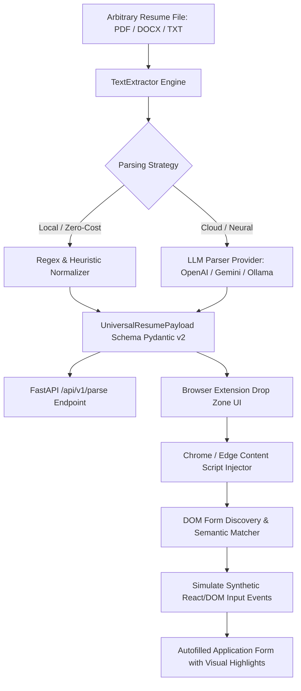

# Universal Resume Extraction and Injection Architecture

## 1. System Overview

The **Universal Resume Extraction and Injection Pipeline** is an end-to-end multi-tier system engineered to solve the fragmented job application problem. It converts arbitrary resume files (PDF, DOCX, TXT, JSON) into a normalized, type-safe JSON schema and automatically injects that structured payload into ATS web forms (Greenhouse, Lever, Workday, Ashby, and generic HTML forms).

---

## 2. Core Components

### Component A: TextExtractor (`backend/app/extractors/text_extractor.py`)
- Ingests files via paths, byte arrays, or streams.
- Multi-engine extraction cascade:
  1. `pdfplumber` (layout-aware text blocks)
  2. `pypdf` / `PyPDF2` (stream token parsing)
  3. `fitz` (PyMuPDF high-speed native extraction)
  4. Zero-dependency OpenXML unzipper for `.docx`
  5. Native Latin-1 / UTF-8 fallback regex extractor for zero-dependency runtime environments.

### Component B: Regex & Heuristic Normalizer (`backend/app/extractors/regex_normalizer.py`)
- Zero-cost, instantaneous regex parsing engine.
- Extracts:
  - **Personal Info**: Emails, US/International phone numbers, LinkedIn URLs, GitHub URLs, portfolio sites, city/state/postal codes.
  - **Work Experience**: Date range span detection (`YYYY - Present`, `Mon YYYY - Mon YYYY`), job title matching, company separation, accomplishment bullets.
  - **Education**: Degrees (BS, MS, PhD), majors, graduation years, GPAs.
  - **Skills**: Matching against a curated taxonomy of 150+ languages, cloud providers, DevOps tools, databases, and frameworks.

### Component C: Universal Resume Schema (`backend/app/models/schema.py`)
- Standardized Pydantic v2 specification containing:
  - `personal_information`
  - `work_history`
  - `education`
  - `skills`
  - `certifications`
  - `projects`
  - `preferences` (work authorization, sponsorship, veteran status)
  - `metadata` (extraction provenance, parser engine, timing)

### Component D: Manifest V3 Browser Extension (`extension/`)
- **Drop Zone Popup**: Drag-and-drop file ingestion, live status indicator, candidate summary card, skills cloud, raw JSON editor, and one-click "Autofill Current Application Tab".
- **Local Storage Sync**: Persists normalized resume profile in `chrome.storage.local` across browser sessions.
- **Content Script Injector (`content/content.js`)**: Runs in the active tab context, maps candidate fields against ATS-specific selectors and semantic fallbacks, dispatches React synthetic input events, and renders success overlays.
